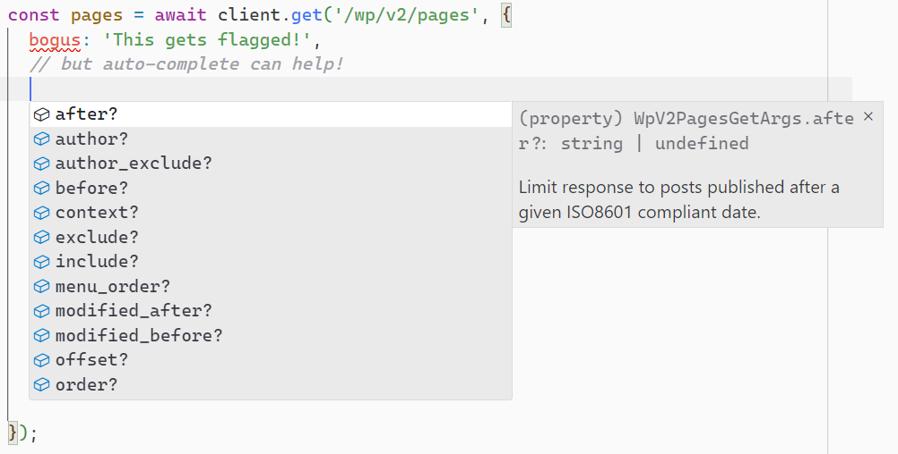

# wordpressed

A modern, Typescript+ESM client for the WordPress REST API. _(Rhymes with “wordpREST”!)_

[](https://www.npmjs.com/package/wordpressed)
[](https://github.com/JaredReisinger/wordpressed/actions?query=workflow%3Abuild+branch%3Aalpha)
[](https://codecov.io/github/JaredReisinger/wordpressed)
[](https://snyk.io/test/github/JaredReisinger/wordpressed/alpha)

> **WARNING:** This is _**very much**_ an early work-in-progress. It is being published so that early feedback on design decisions can be made.

## _What is this?_

This is an attempt at bringing Typescript and ESM support to the [WordPress REST API](https://developer.wordpress.org/rest-api/) world. The intent is to have a very-thin-at-runtime, but very-rich-at-edit/build-time library that makes it very, very easy to call WordPress REST API routes/endpoints and pass the correct parameters and arguments, and _**know**_ what type of values you should be getting back. The hope is that a huge amount of the heavy lifting can be automagically generated thanks to the WordPress REST API’s built-in [discovery mechanism](https://developer.wordpress.org/rest-api/using-the-rest-api/discovery/).

Ideally, when calling, say, the `GET /wp-json/wp/v2/pages` endpoint, Typescript can prevent you from passing invalid arguments, and can provide auto-complete for the correct ones… and even provide some documentation about them, as well!



I’d also like a “namespace-streamlined” client, so you could, say, lock it to a single namespace, and vastly simplify the calls. [My use-case in particular](https://www.npmjs.com/package/order-fetcher) could look like:

```ts
const client = new NamespaceClient('https://somehost.com', 'wc/v3');
const orders = await client.get('orders', { after: '2023-01-01' });
```

... which, to me, looks _waaaaaay_ cleaner and easier than most other options available. _(Note that the namespace-specific client is not yet implemented!)_

### Current roadblocks / thoughts

- The WordPress REST API discovery mechanism does not seem to provide _**any**_ response field information whatsoever. To me, this seems like a complete oversight. These response types _might_ have to be completely hand-written, which is unfortunate.

- The namespace/route/endpoint generation is currently dependent on a WordPress instance that I can reach. It does not have all possible plugins/namespaces available. I am attempting to structure this type information in a way that it will be easy to take contributions to this library. I’m also hoping to make it relatively easy to create your own custom routes/type mappings for _**your**_ specific WordPress server, and provide those directly to the “standard” library, _without_ needing to necessarily contribute them back, so that you’re never stuck waiting for an update in order to handle your specific use-case. (Which might make possible som number of "extension pacakges" that just augment the set of available routes/types.)

## TODO / Roadmap

- [ ] Generate route/endpoint argument types

  - [x] basic types (string, integer, etc.)

  - [ ] array items

  - [ ] objects

- [ ] Generate route path (regexp match) parameters

- [ ] Generate response types for routes/endpoints _(It appears that the WordPress developers didn’t think reponses needed to be discoverable… I don’t believe there is **any** queryable/parseable response information at all.:facepalm:)_

- [x] Create route/endpoint-to-argument type safety

- [ ] Create all-purpose get/post/patch/etc. client calls

  - [ ] very rough stubbed calls

  - [ ] argument support

  - [ ] route parameter support

- [ ] Create streamlined “namespace-specific” client?

- [ ] Generate namespace-specific authentication? (WooCommerce has its own, but I don’t see that “magic” exposed in the discovery information.)

## _Why?_

The existing WordPress API client wrappers (or namespace-specific ones, like for WooCommerce) are somewhat frustrating to use, and their Typescript typings are often either nonexistent or incorrect (in one case because of very non-standard Javascript export objects). The _de facto_ standard WP API client library hasn’t been updated for years, and doesn’t follow modern design patterns, predates ESM, etc.

Further, the WordPress REST API is designed in such a way that most, if not all, API calls follow the same pattern. All that really differs is the shape of the data going in, and the shape coming out… exactly the thing for which Typescript excels!

On top of that, I have [a particular use-case](https://www.npmjs.com/package/order-fetcher) for which a modern client would be incredibly beneficial.
